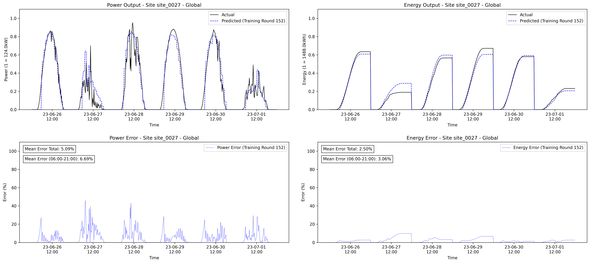
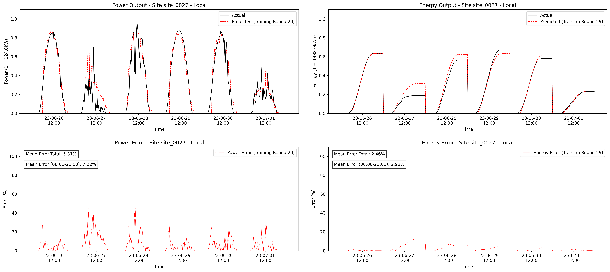
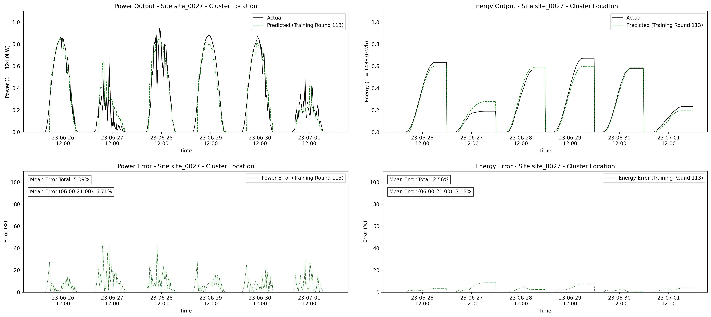
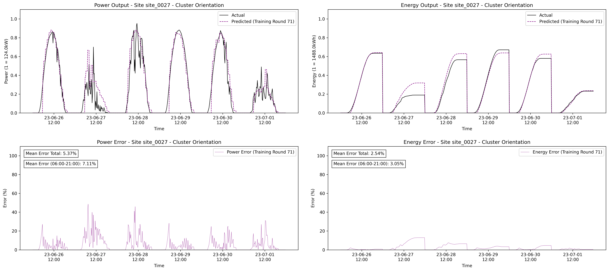
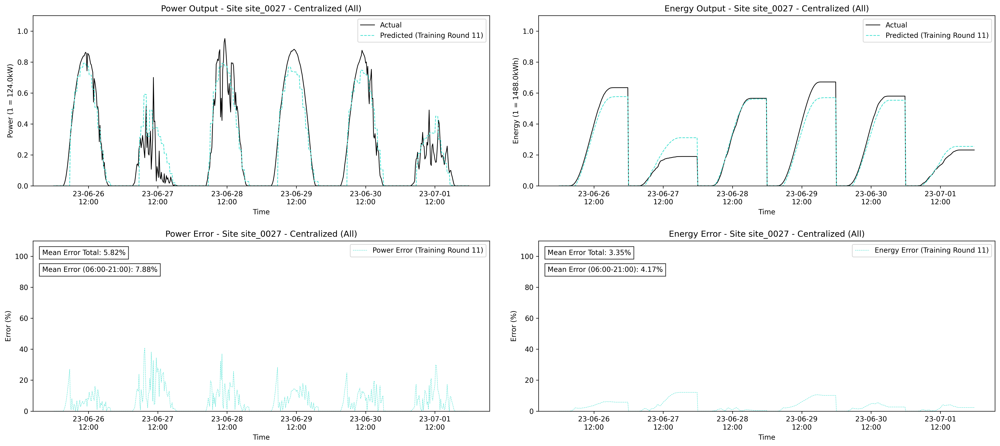
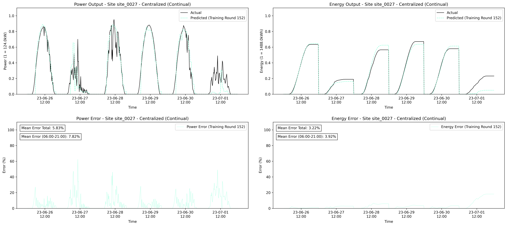

# FedCCL: Federated Clustered Continual Learning Framework for Privacy-focused Energy Forecasting

## Abstract
Privacy-preserving distributed model training is crucial for modern machine learning applications, yet existing Federated Learning approaches struggle with heterogeneous data distributions and varying computational capabilities. Traditional solutions either treat all participants uniformly or require costly dynamic clustering during training, leading to reduced efficiency and delayed model specialization. We present FedCCL (Federated Clustered Continual Learning), a framework specifically designed for environments with static organizational characteristics but dynamic client availability. By combining static pre-training clustering with an adapted asynchronous FedAvg algorithm, FedCCL enables new clients to immediately profit from specialized models without prior exposure to their data distribution, while maintaining reduced coordination overhead and resilience to client disconnections. Our approach implements an asynchronous Federated Learning protocol with a three-tier model topology — global, cluster-specific, and local models — that efficiently manages knowledge sharing across heterogeneous participants. Evaluation using photovoltaic installations across central Europe demonstrates that FedCCL's location-based clustering achieves an energy prediction error of 3.93% (±0.21%), while maintaining data privacy and showing that the framework maintains stability for population-independent deployments, with 0.14 percentage point degradation in performance for new installations. The results demonstrate that FedCCL offers an effective framework for privacy-preserving distributed learning, maintaining high accuracy and adaptability even with dynamic participant populations.

## Examples of Predictions

The following figures provide examples of predictions for a site during the period from 2023-06-26 to 2023-07-01. These plots demonstrate the different federated and centralized approaches.

### Federated Approaches

- **(a) Federated Global**  
  

- **(b) Federated Local**  
  

- **(c) Federated Cluster Location**  
  

- **(d) Federated Cluster Orientation**  
  

### Centralized Approaches

- **(e) Centralized (All)**  
  

- **(f) Centralized (Continual)**  
  


## How to Start Training

To begin training the system using the provided files, follow these steps. These files configure different components of the system, including the client and server components for both training and prediction tasks. Below is a guide to get started:

### 1. Set Up Docker Environment

##### Dependencies
* Docker: Required for containerizing and managing the training and prediction processes in a portable manner.

Ensure that Docker is installed and running on your machine. Docker containers are used to orchestrate the components involved in the federated learning process.

### 2. Use Docker Compose

- **Centralized Client Prediction**: If you want to run a prediction using a centralized client model, use the `docker-compose.centralized-client-prediction.yml` file.
    ```bash
    docker-compose -f test/docker-compose.centralized-client-prediction.yml up
    ```

- **Centralized Client Training**: To train the model using centralized methods, use the `docker-compose.centralized-client-training.yml` file.
    ```bash
    docker-compose -f test/docker-compose.centralized-client-training.yml up
    ```

- **Client Prediction**: For federated client prediction tasks, use the `docker-compose.client-prediction.yml` file.
    ```bash
    docker-compose -f test/docker-compose.client-prediction.yml up
    ```

- **Client Training**: To initiate federated client-side training, use the `docker-compose.client-training.yml` file.
    ```bash
    docker-compose -f test/docker-compose.client-training.yml up
    ```

- **Server Configuration**: The server side of the federated learning system is configured in `docker-compose.server.yml`. It manages the overall process of coordinating clients and performing model aggregation.
    ```bash
    docker-compose -f test/docker-compose.server.yml up
    ```

### 3. Train the Model
To start training, you will need to run the appropriate Docker Compose commands based on your setup. If you are focusing on federated learning, you will primarily use `docker-compose.client-training.yml` for client-side model training. 

After starting the Docker containers, the clients will start their local training using their respective datasets, without sharing raw data with the server. The server will aggregate the model updates asynchronously, allowing continual learning over time.

